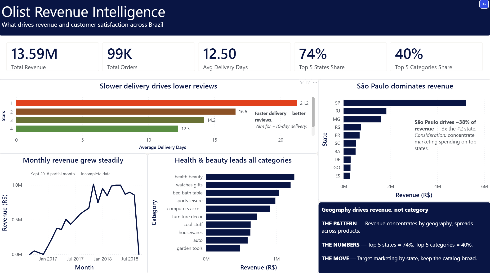

# Olist Revenue Intelligence Dashboard

An end-to-end analytics project on the [Brazilian Olist e-commerce dataset](https://www.kaggle.com/datasets/olistbr/brazilian-ecommerce): from raw data to a decision-ready Power BI dashboard. Built to answer one question — **what drives revenue and customer satisfaction across Brazil?** — and to translate each finding into an action a manager can take.

> **Note:** Personal learning project using the public Olist dataset. Not affiliated with or endorsed by Olist.

---

## The headline findings

| # | Question | Finding | Decision it points to |
|---|----------|---------|-----------------------|
| Q1 | How did revenue trend over time? | Steady month-over-month growth, peaking Nov 2017 (holiday shopping) | Plan inventory and marketing around the Q4 peak |
| Q2 | Which categories drive revenue? | Health & beauty leads; revenue is **spread** — top 5 categories = only ~40% | Keep the product catalog broad |
| Q3 | Which states drive revenue? | São Paulo alone is ~38% of revenue (3x the #2 state) | Concentrate marketing spend geographically |
| Q4 | Geography vs. product concentration | Top 5 states = **74%** of revenue vs. top 5 categories = **40%** | Target marketing by state, keep catalog broad |
| Q5 | Does delivery speed affect reviews? | 5-star orders arrive in ~10 days; 1-star orders take **2x longer** (~21 days) | Set a ~10-day delivery target, fix slowest shipments |

**Revenue definition (locked):** R\$13,591,643.70 — sum of item price, freight excluded as pass-through. Every query and measure is verified against this figure.

---

## The delivery-to-reviews story

The strongest finding is a clean staircase: as delivery time rises, review scores fall.

| Review score | Avg delivery days | Orders |
|:---:|:---:|:---:|
| 5 stars | 10.2 | 57,066 |
| 4 stars | 11.8 | 18,987 |
| 3 stars | 13.8 | 7,961 |
| 2 stars | 16.2 | 2,941 |
| 1 star | 20.8 | 9,406 |

Delivery speed is a measurable driver of customer satisfaction — not a soft factor. Backed by 96k+ scored orders.

---

## Dashboard



A single-screen Power BI report: a KPI scorecard up top, the main delivery-vs-reviews chart, revenue broken down by category / state / time, and a summary panel stating the geography-vs-product conclusion.

---

## Tech stack

- **PostgreSQL** — 8-table relational schema, composite keys, foreign-key constraints
- **SQL** — joins, CTEs, subqueries, aggregation, date functions
- **Power BI** — DAX measures (TOPN, DATEDIFF, DIVIDE, SUM, AVERAGE), Power Query cleaning, custom brand theme
- **Excel** — pivot tables, lookups, conditional formatting (earlier analysis phase)
- **PowerPoint** — executive briefing deck

---

## Repo structure

```
olist_revenue_intelligence_dashboard/
├── README.md
├── blueprint_dashboard/     # dashboard screenshot + layout blueprint
├── dataset/                 # raw Olist source data
├── dbdiagram_ERD_entity_relationship_diagram/   # schema diagram (ERD)
├── exports/                 # query result files (Q1–Q5)
├── olist_revenue_database/  # PostgreSQL schema + analysis queries
├── phases/                  # project phase documentation (1–4)
├── powerbi/                 # Power BI report (.pbix) + custom theme
└── powerpoint/              # executive briefing deck
```

---

## Project phases

1. **Sourcing & scoping** — selected the dataset, framed the business questions
2. **Cleaning & validation** — staging tables, fixed encoding/duplicate/orphan issues in SQL, row-count checks with zero rows deleted
3. **SQL analysis + Excel** — computed the five findings, verified against the locked revenue figure
4. **Communication & storytelling** — Power BI dashboard, this repo, and a PowerPoint briefing

---

## Dataset

Public [Olist Brazilian E-Commerce dataset](https://www.kaggle.com/datasets/olistbr/brazilian-ecommerce) — ~99k orders, ~340k rows across 8 tables, covering Sept 2016 – Sept 2018.

*Sept 2018 is a partial month; its incomplete data is annotated on the revenue trend chart rather than hidden.*
