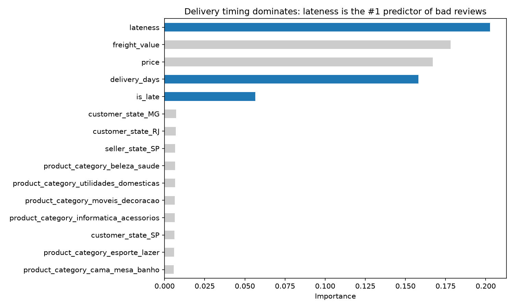

# Predicting Bad Reviews Before They Happen

**Part 2 of the Olist Revenue Intelligence project** — turning the Q5 delivery finding into a predictive early-warning tool.

## The question

Part 1 found that slow deliveries correlate with bad reviews. But that only explains the past — by the time a 1-star review is written, the customer is already gone.

This phase asks: **Can we predict which orders are heading for a bad review before it happens?** If so, a business could flag at-risk orders while they're still in transit and intervene — a proactive message, a discount, a shipping upgrade — instead of reacting after the damage is done.

## The finding



The random forest ranked **lateness — how far an order missed its promised delivery date — as the #1 predictor** out of 126 features. Three of the top five features are delivery timing (lateness, delivery days, and a late flag), together accounting for roughly 40% of the model's decisions.

The revealing detail: **lateness outranked raw delivery speed.** A 20-day delivery promised in 25 days doesn't upset anyone; a 5-day delivery promised in 3 does. Customers react to broken promises, not clock time.

Shipping cost and order price followed closely at #2 and #3 — expensive orders and expensive shipping raise expectations. Product category and customer location barely registered, scoring near zero across all ~120 encoded columns.

## The decision

**Stop optimizing purely for speed. Optimize for keeping the promise.** Part 1 recommended a ~10-day delivery target, but Part 2 refines that: lateness against the estimated date predicts bad reviews better than raw delivery time does. A conservative estimate that gets met beats an aggressive one that gets missed.

Since bad reviews aren't concentrated in specific categories or regions, this is an execution problem, not a product or market problem — the fix applies everywhere.

**Operationally:** score orders in transit and flag the high-risk ones. At 50% recall, the model catches half of all bad reviews before they land — enough to intervene with a proactive message, a discount, or a shipping upgrade while the outcome is still changeable.

## Results

Two models trained on the same 80/20 stratified split (70,356 train / 17,590 test):

| Model | Recall | Precision | ROC-AUC |
|---|---|---|---|
| **Logistic Regression** | **50%** | 35% | 0.728 |
| Random Forest | 35% | **51%** | 0.731 |

Overall performance is nearly identical (ROC-AUC 0.728 vs 0.731), but the two models trade off differently. Logistic regression casts a wider net — it correctly predicts half of all bad reviews, but wrongly flags 2,317 good orders. Random forest is pickier — when it flags an order it's right more often, but it misses more of the bad ones entirely.

**Logistic regression is the better fit here.** For an early-warning system, missing an at-risk order costs more than a false alarm: a wasted courtesy email is cheap, a lost customer isn't.

**Why not accuracy?** Only 14% of orders receive a bad review. A model that predicted "good" for every single order would score 86% accurate and catch nothing. Precision and recall measure what actually matters.

## Approach

1. **Feature pull (SQL)** — one row per order with delivery timing, cost, category, and location, plus a binary bad-review label. Multi-item orders collapsed to order level; 3-star reviews dropped as the ambiguous middle.
2. **Cleaning (pandas)** — removed 446 duplicate order IDs, filled 1,273 missing categories. Final dataset: 87,946 orders.
3. **Feature engineering** — built a cross-state shipping proxy, one-hot encoded categoricals into 126 total features.
4. **Train/test split** — 80/20, stratified to preserve the 14% bad-review rate in both sets.
5. **Modeling** — logistic regression (scaled, class-weighted) and random forest, both trained on the identical split.
6. **Evaluation** — precision, recall, F1, confusion matrix, ROC-AUC.

**Guarding against leakage:** every feature is knowable at or before delivery. The review score is used only as the training label, never as an input.

## Files

```
ml-model/
├── sql/feature_pull.sql              # SQL feature extraction
├── scripts/
│   ├── 01_load_and_explore.py        # load, EDA, clean, encode → processed_features.csv
│   └── 02_train_model.py             # split, train, evaluate, feature importance
├── data/order_features.csv           # SQL output (input to script 01)
└── outputs/feature_importances.png   # headline chart
```

## Dataset

Public [Olist Brazilian E-Commerce dataset](https://www.kaggle.com/datasets/olistbr/brazilian-ecommerce) — same data as Part 1, new use.